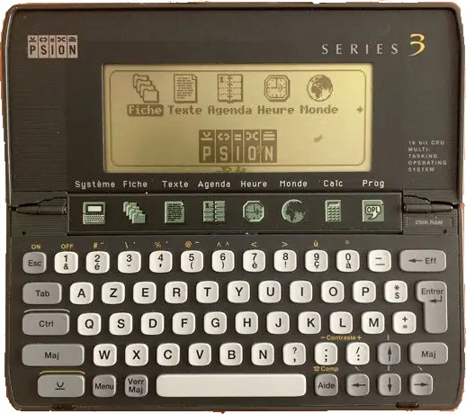
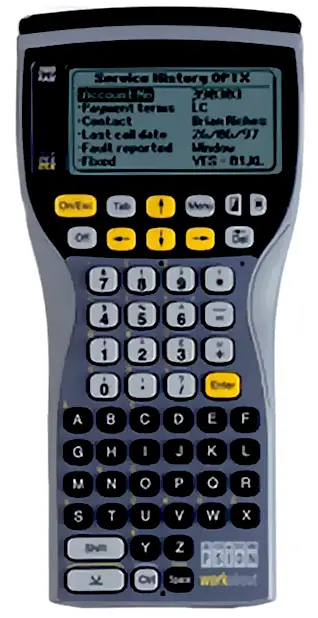
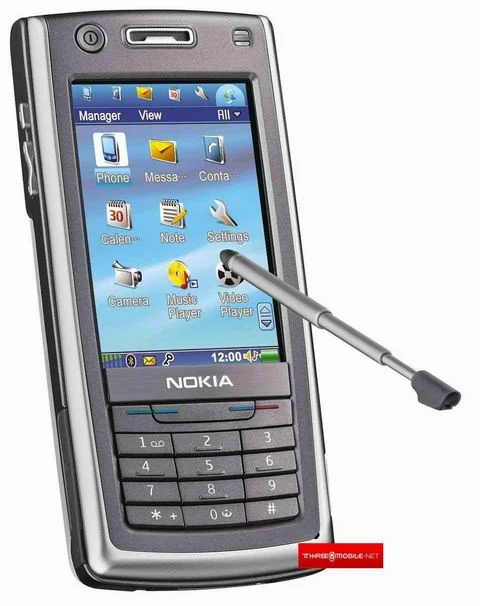

# Histoire du développement mobile

## Psion

À la fin des années 80 la société britannique **Psion**  développe **EPOC**, un système d’exploitation pour OS mobile. Il est l’un des premiers systèmes d’exploitation pensés spécifiquement pour les appareils mobiles et plus spécifiquement pour les assistants personnels (PDA). Il fonctionne d’abord en version 16 bits (EPOC16), puis évolue vers une version 32 bits (EPOC32), plus moderne.

EPOC introduit plusieurs concepts importants pour l’époque : un système multitâche préemptif, une exécution depuis la mémoire ROM (pour économiser les ressources) et la possibilité pour les utilisateurs de développer leurs propres applications via un langage simple proche du BASIC (OPL _Open Programming Language_). La version 32 bits marque une évolution majeure avec une architecture orientée objet en C++, une évolution du langage BASIC compatible avec Microsoft Visual Basic (OVAL _Object-based Visual Application Language_) un support des processeurs ARM (une autre entreprise britannique) et une volonté d’ouvrir la plateforme à d’autres constructeurs.

[Plaquette commerciale Psion Workabout](workabout.pdf)

En 1998, Psion fonde avec Nokia, Ericsson et Motorola une coentreprise pour développer Symbian OS, un nouveau système pour une nouvelle génération de téléphones mobiles.

## Symbian OS

Symbian OS équipera de nombreux smartphones au début des années 2000, notamment chez Nokia.

Au fil des années, **Nokia** fait évoluer Symbian pour répondre à des usages de plus en plus riches : navigation web, multimédia, GPS, applications tierces. 

Plusieurs variantes apparaissent (UIQ chez Ericsson, S60 chez Nokia), ce qui entraîne une forte fragmentation. Le développement repose principalement sur le C++, avec des API complexes et peu homogènes, rendant l’écosystème difficile d’accès pour les développeurs. 

Malgré sa domination commerciale (39 % de parts du marché mondial en 2008), Symbian souffre d’un retard en matière d’expérience utilisateur et d’outillage de développement, surtout face à l’arrivée de nouveaux standards plus simples et plus cohérents.

En 2010 Symbian^3 est la dernière version majeur du système. Un ancien dirigeant de Microsoft est alors nommé comme PDG de Nokia.

### Maemo

Maemo est une plateforme logicielle basée sur Linux, développée à l’origine par Nokia pour ses tablettes Internet puis certains smartphones. Techniquement, elle repose sur une distribution dérivée de Debian et s’appuie sur des composants open source comme le noyau Linux, GNOME et GTK+, avec une interface utilisateur spécifique appelée Hildon. Elle a été utilisée notamment sur les Nokia 770, N800, N810 et N900, et visait à fournir un environnement complet pour appareils mobiles avant l’essor d’Android et iOS.

Maemo n’est pas seulement un système d’exploitation, mais aussi une plateforme de développement et un écosystème logiciel. Elle inclut des outils de développement (SDK), un gestionnaire de paquets basé sur APT/dpkg, et une forte intégration avec des projets Linux existants. L’interface est pensée pour le tactile avec un “home screen” personnalisable et des applications organisées en widgets et raccourcis, ce qui était relativement innovant pour l’époque des premiers smartphones.

En janvier 2008 Nokia achète l'entreprise Trolltech, le développeur de la bibliothèque Qt. Qt est concurrent à GTK+ et est le moteur du bureau KDE concurrent de Gnome.

Sur le plan historique, Maemo a été un projet stratégique pour Nokia afin de concurrencer les plateformes mobiles émergentes. Le projet a ensuite été fusionné avec **Moblin** d’Intel pour former **MeeGo** en 2010, marquant l’arrêt progressif de Maemo en tant que produit principal. Malgré cela, son héritage continue via des projets communautaires et certaines bases techniques réutilisées dans d’autres systèmes Linux mobiles.

## MeeGo

MeeGo est un système d’exploitation open source lancé en 2010, issu de la fusion de deux projets : Maemo (porté par Nokia) et Moblin (développé par Intel). L’objectif est de créer une plateforme Linux unifiée capable de fonctionner sur différents types d’appareils : smartphones, tablettes, netbooks et systèmes embarqués. MeeGo repose sur une architecture moderne, avec un noyau Linux et des technologies comme Qt pour le développement d’applications, ce qui le rend théoriquement attractif pour les développeurs.

Sur le plan technique, MeeGo propose une approche plus ouverte et flexible que Symbian, avec une interface moderne et une meilleure adaptation aux écrans tactiles. Il est notamment utilisé sur un appareil emblématique, le Nokia N9, souvent salué pour son ergonomie innovante (navigation par gestes). MeeGo est perçu comme une tentative sérieuse de Nokia pour revenir dans la course face à iPhone et Android.

Cependant, le projet est rapidement abandonné après le partenariat stratégique entre Nokia et Microsoft, qui impose Windows Phone comme priorité. MeeGo n’a donc pas le temps de se développer ni de construire un écosystème solide. Il reste néanmoins important dans l’histoire du mobile comme une tentative avancée de plateforme ouverte, et il influencera plus tard d’autres projets dérivés comme **Sailfish OS**.

## Stephen Elop

Stephen Elop joue un rôle central dans la phase finale de Nokia sur le marché du mobile, à un moment critique de son histoire.

C'est un ancien dirigeant de Microsoft. Nommé PDG de Nokia en 2010, il hérite d’une entreprise encore dominante en volume mais en perte de vitesse face à iPhone et Android. Il devient célèbre pour son mémo interne dit de la “burning platform” (plateforme en feu), dans lequel il explique que Nokia doit changer radicalement de stratégie pour survivre.

Sa décision la plus marquante est l’abandon progressif de Symbian et du projet MeeGo au profit d’un partenariat stratégique avec Microsoft. Nokia adopte alors **Windows Phone** comme système principal pour ses smartphones (gamme Lumia). Ce choix vise à créer un “troisième écosystème” capable de rivaliser avec iOS et Android, mais il arrive trop tard et ne parvient pas à inverser la tendance du marché.

Finalement, cette stratégie conduit à la vente de la division mobile de Nokia à Microsoft en 2013. Le rôle de Stephen Elop est donc controversé : pour certains, il a tenté une transformation nécessaire dans un contexte très difficile ; pour d’autres, il a accéléré le déclin de Nokia en abandonnant trop vite ses propres technologies.

## Palm

Développé par Palm, Palm OS (également connu sous le nom de **Garnet OS**) était l'un des premiers systèmes d'exploitation mobiles conçus pour les assistants numériques personnels (PDA) avant de passer aux premiers smartphones. Il était léger, convivial et avait un écosystème solide d'applications. Des appareils comme le Palm Pilot, le Palm Treo et le Handspring Visor étaient très populaires parmi les professionnels. Cependant, Palm OS a eu du mal avec le manque de multitâches, l'interface utilisateur obsolète et l'évolution limitée du matériel. En 2009, Palm a abandonné Palm OS en faveur de **WebOS**, mais à ce moment-là, iOS et Android avaient déjà pris le relais.

Développé par Palm, WebOS était en avance sur son temps avec des fonctionnalités telles que le véritable multitâche, la commutation d'applications par carte et les contrôles gestuels. Cependant, l’acquisition de Palm par **HP** et les mauvaises décisions stratégiques ont conduit à sa disparition. 

La philosophie de **webOS** est de considérer le web comme plateforme applicative principale : les applications sont développées en HTML/CSS/JavaScript avec des API système pour accéder au matériel, ce qui en fait clairement une tentative de promouvoir des applications hybrides (voire entièrement web) comme alternative au natif. Dans la même logique, **Firefox OS** (Mozilla) visait un OS 100 % web, tandis que **Chrome OS** (Google) et **Tizen** (Samsung) adoptent des approches hybrides mêlant web et natif.

Aujourd’hui, les restes de WebOS se retrouvent dans les téléviseurs intelligents de **LG**.

## Samsung

Samsung a longtemps cherché à réduire sa dépendance à Android en développant ses propres systèmes : d’abord **Bada** en 2010, un OS mobile propriétaire finalement abandonné faute d’écosystème, puis **Tizen**, conçu comme une plateforme plus ouverte et orientée web (HTML5) issue en partie de MeeGo ; si Tizen n’a jamais percé sur smartphone, Samsung l’a recyclé avec succès dans d’autres segments (montres connectées, téléviseurs, IoT), illustrant une stratégie pragmatique consistant à tester des alternatives à Android tout en les repositionnant selon les opportunités de marché.

## Les constructeurs chinois

Plusieurs constructeurs chinois ont cherché à s’émanciper d’Android ou à le contrôler davantage via des forks et surcouches : Xiaomi avec MIUI, Oppo (ColorOS) ou Vivo (Funtouch OS / OriginOS) restent techniquement basés sur Android mais construisent leurs propres écosystèmes (stores, services cloud, API), afin de maîtriser l’expérience utilisateur et la distribution applicative. D’autres tentatives plus radicales ont existé, comme YunOS d’Alibaba Group, orienté cloud, mais sans adoption durable hors de niches.

Le cas de Huawei est plus structurant : après les restrictions américaines de 2019 limitant l’accès aux services Google, le groupe a accéléré le développement de **HarmonyOS** (Hongmeng), un OS distribué visant à unifier smartphones, IoT et autres appareils, avec un écosystème propre (HMS). Bien que les premières versions reposaient encore partiellement sur Android (AOSP), Huawei cherche progressivement à s’en détacher techniquement et stratégiquement, en bâtissant une alternative complète — illustrant une volonté d’indépendance technologique bien plus poussée que celle de ses concurrents chinois.

## IVI (In-Vehicle Infotainment OS)

MB.OS (Mercedes), VW.OS, BMW OS, Android Automotive, Arene (Toyota), Tesla OS

## Résumé

OS | Fabricant | Période | Langage
---|---|---|---|
[EPOC](https://en.wikipedia.org/wiki/EPOC_(operating_system))       | Psion (UK) | 1989 - 2000 | OPL OVAL
[Symbian OS](https://en.wikipedia.org/wiki/Symbian)                 | Psion Nokia Ericsson Motorola | 1998 - 2012 | C++
[BlackBerry OS](https://en.wikipedia.org/wiki/BlackBerry_OS)        | RIM | 1999 - 2013 |
[Bada](https://en.wikipedia.org/wiki/Bada_(operating_system))       | Samsung    | 2010 - 2014 | C++
[Maemo](https://en.wikipedia.org/wiki/Maemo)                        | Nokia | 2005 - 2011 | C++
[Meego](https://en.wikipedia.org/wiki/MeeGo)                        | Nokia | 2010 - 2012 |
[Tizen](https://en.wikipedia.org/wiki/Tizen)                        | Samsung | 2012 - |
[Palm OS](https://en.wikipedia.org/wiki/Palm_OS)                    | Palm | 1996 - 2009 |
[WebOS](https://en.wikipedia.org/wiki/WebOS)                        | Palm, HP, LG | 2009 - |
[Windows Mobile](https://en.wikipedia.org/wiki/Windows_Mobile)      | Microsoft | 2000 - 2010 |
[Windows Phone](https://en.wikipedia.org/wiki/Windows_Phone)        | Microsoft | 2010 - 2015 |
[Windows 10 Mobile](https://en.wikipedia.org/wiki/Windows_10_Mobile) | Microsoft | 2015 - 2020 |
[Windows 11](https://en.wikipedia.org/wiki/Windows_11)              | Microsoft | 2021 -  |
[Firefox OS](https://en.wikipedia.org/wiki/Firefox_OS)              | Mozilla | 2013 - 2015
[HarmonyOS](https://en.wikipedia.org/wiki/HarmonyOS)                | Huawei  | 2019 - 