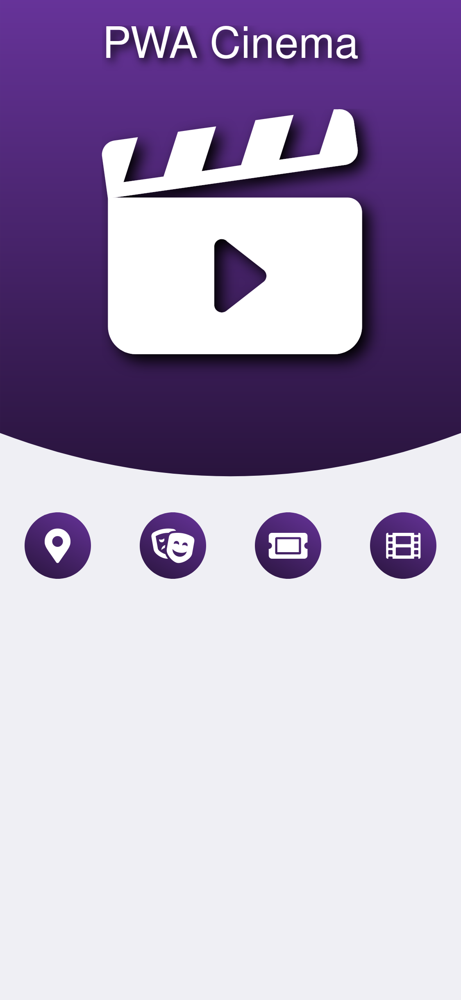
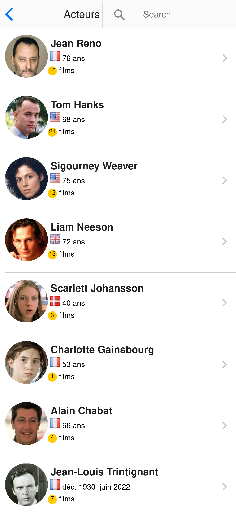
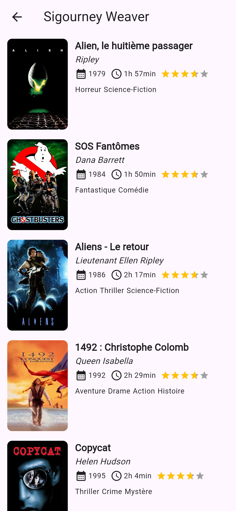
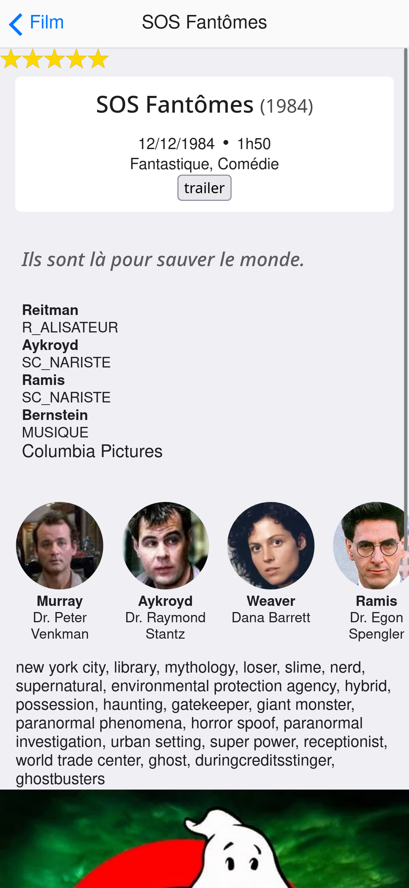
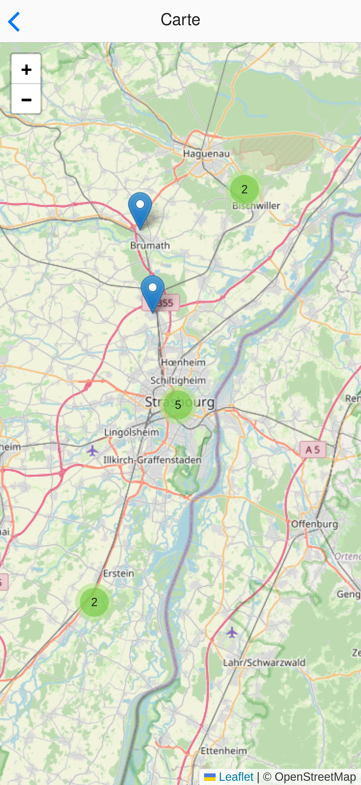

+++
title = "Travaux pratiques"
+++

> Concevoir une application sur le cinema avec **Flutter**
{class=objectif}

Une première maquette de l'application a été faite en HTML. Voici les différents écrans :

Accueil


Liste des acteurs


Liste des films pour un acteur


Détail d'un film


Carte des établissements


Les différents éléments graphiques du projet.

 Photo du profile par défaut

 Image de l'affiche de film par défaut.

 Icone 1

 Icone 2

## Étape TP 1 / 4

En partant de l'exercice de TD. Concevoir d'abord la liste des acteurs.

Utiliser pour l'avatar un sytème de fallback vers une ressource locale à l'application.

Dans un premier temps l'utilisateur n'a pas à interragir avec la liste des acteurs. Utiliser un Widget Stateless et un `FuturBuilder` pour construire la liste.

[tp 1](acteurs)


## Étape RP 2 / 4

Mettre en place une [navigation](../flutter/navigation) vers l'écran de la liste des films.

Cette liste n'a pas à interragir avec l'utilisateur.

```
GET http://localhost:3000/equipes?personne_id=eq.3&role=eq.acteur&select=alias,role,films(film_id, titre, annee, duree, genres(*),votes(*))
```

### Étape 3 / 4

[carte](carte)

### Étape 4 /4

Mettre en place une [navigation](../flutter/navigation) à l'aide d'une BottomNavigationBar.

1. Créer une nouvelle vue Scaffold. Ajouter à l'intérieur une BottomNavigationBar

```dart
bottomNavigationBar: BottomNavigationBar(
```

Ajouter 3 icones à la propriété item : map, theater_comedy et quiz

2. Ajouter les 3 écran superposés l'un sur l'autre à l'aide d'un widget Stack. Seul la vue en cours sera visible. Les autres seront offstage.

```dart
Stack(
  children: List.generate(3, (index) {
    return Offstage(
      offstage: _currentIndex != index,
      child: Navigator(
        key: _navigatorKeys[index],
        onGenerateRoute: (settings) {
          return MaterialPageRoute(builder: (_) => _getPage(index));
        },
      ),
    );
  }),
)
```

écrire la fonction _getPage qui retourne la bonne vue en fonction de l'index.

Créer un tableau (_navigatorKeys) de 3 identifiants uniques

```dart
final _navigatorKeys = [
    GlobalKey<NavigatorState>(),
    GlobalKey<NavigatorState>(),
    GlobalKey<NavigatorState>(),
  ];
```
3. Encapsuler le scaffold dans un widget PopScope

PopScope est un widget dans Flutter qui permet aux développeurs de gérer le comportement du back de la navigation. Avec PopScope, vous pouvez contrôler si un utilisateur est autorisé à naviguer en arrière (c'est-à-dire, pop la route), et vous pouvez même capturer le résultat de cette navigation.

Propriétés clés de PopScope

canPop: Une valeur booléenne qui détermine si la route peut être éjectée. Si le canPop est mis à faux, le geste de navigation arrière (comme le bouton de retour du système ou le geste de balayage) sera désactivé.

onPopInvokedWithResult: Un rappel de fonction callback qui est invoqué lorsqu'une navigation pop est déclenchée. Il fournit deux paramètres:

didPop: Un booléen qui indique si la navigation a été un succès.

result: Les données sont renvoyées lorsque l'itinéraire est mis en pêché. Cela peut être utile pour renvoyer les résultats après le démarrage d'une route, par exemple lorsqu'un formulaire est soumis ou que des données sont collectées.

## Recherche

Ajouter un champ de recherche sur la liste des acteurs.

1. Rendre le widget Statefull car il est maintenant interractif

2. Ajouter un textField dans le titre de l'appBar

```dart
TextField(autofocus: true,
  decoration: InputDecoration(
    hintText: 'Rechercher...',
    border: InputBorder.none,
  ),)
```

Pour lire le contenu il faut controller le widget TextField.

```dart
TextEditingController _searchController = TextEditingController();
```

3. Ajouter une deuxieme liste qui sera un filtre de la liste principale. Utiliser cette deuxième liste comme source du listViewbuilder

4. Ajouter l'événement onChanged sur le widget TextField et filtrer la liste des acteurs

5. Mémoriser dans un variable la fonction getActeurs. Sinon à chaque changement d'état le widget est reconstruit (build) et la fonction est appelée.

6. Ajouter le package dart_phonetics et filter sur la propriété metaphone de l'acteur. utiliser la fonction DoubleMetaphone

```dart
final encoder = DoubleMetaphone.withMaxLength(10);
final encoding = encoder.encode(recherche);
```
