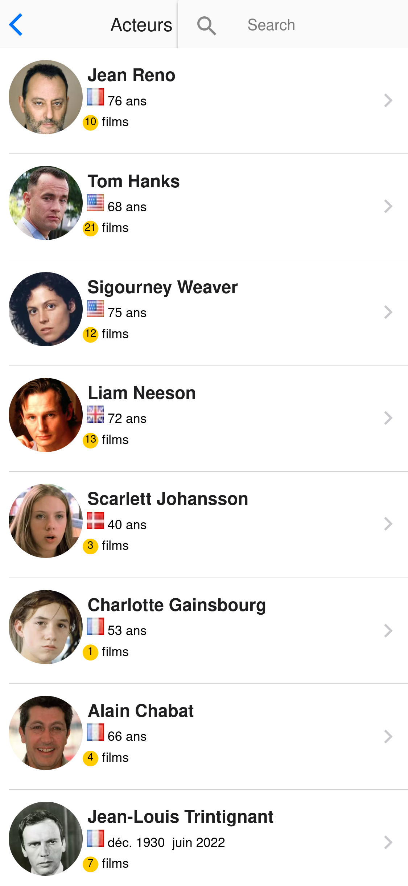
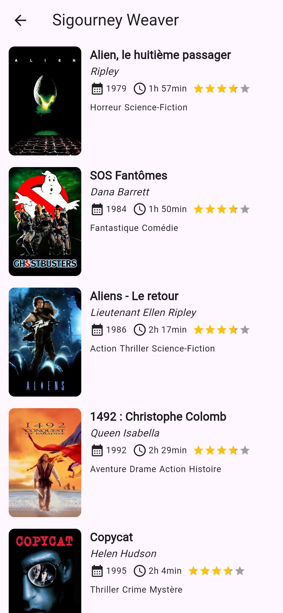
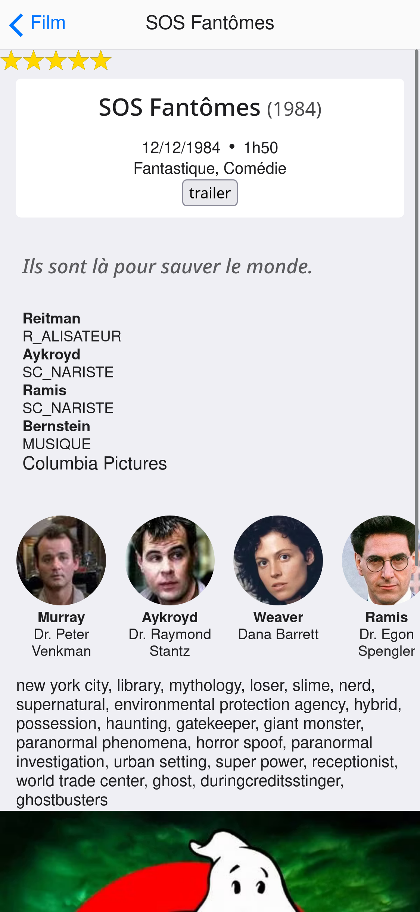
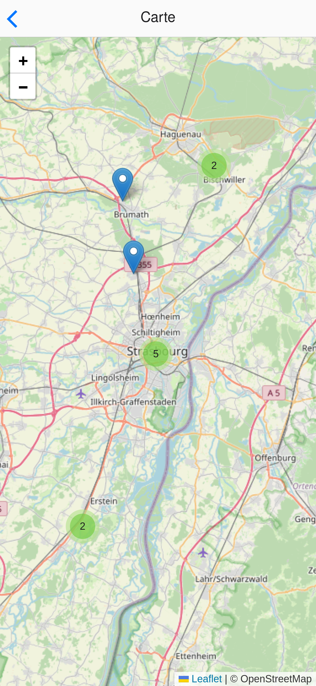

# Travaux pratiques

> [!NOTE]
> Concevoir une application sur le cinema avec **Flutter**


Une première maquette de l'application a été faite en HTML. Voici les différents écrans :

## Accueil


## Liste des acteurs



## Liste des films pour un acteur



## Détail d'un film



## Carte des établissements



Les différents éléments graphiques du projet.

 Photo du profile par défaut

 Image de l'affiche de film par défaut.

 Icone 1

 Icone 2

<a href="cinema.svg">Icone SVG</a>

## Étape TP 1 / 4

En partant de l'exercice de TD. Concevoir d'abord la liste des acteurs.

Utiliser pour l'avatar un sytème de fallback vers une ressource locale à l'application.

Dans un premier temps l'utilisateur n'a pas à interragir avec la liste des acteurs. Utiliser un Widget Stateless et un `FuturBuilder` pour construire la liste.

### Photo de l'acteur

https://img.neotech.fr/cgi/images/tr:quality=100/cinema%2fprofiles%2f***id***.jpg

## Étape 2 / 5

Mettre en place une [navigation](../flutter/navigation) vers l'écran de la liste des films.

Cette liste n'a pas à interragir avec l'utilisateur.

```
https://api.neotech.fr/equipes?personne_id=eq.3&role=eq.acteur&select=alias,role,films(film_id, titre, annee, duree, genres(*),votes(*))
```

Affiche du film :

https://img.neotech.fr/cgi/images/tr:quality=100/cinema%2fposters%2f***id***.jpg


### Étape 3 / 5

Mettre en place une navigation pour aller au détail du film


### Étape 4 / 5

Mettre en place une carte des établissements autour de votre position

[carte](carte)


### Étape 5 / 5

Ajouter un widget pour afficher la note sous forme d'étoiles remplies en partie.

Compléter le modèle film

```
https://api.neotech.fr/films?film_id=eq.11&select=*,votes(moyenne,votants),resumes(resume),genres(*),motscles(*),equipes(role, alias, ordre, personnes(prenom, nom)),productions(societes(societe))
```

Afficher la liste des acteurs du film.
